# Creating a Web App in Azure

## Table of Contents
1. [Introduction](#introduction)
2. [Prerequisites](#prerequisites)
3. [Step-by-Step Guide](#step-by-step-guide)
    - [1. Create an Azure Account](#1-create-an-azure-account)
    - [2. Create a Resource Group](#2-create-a-resource-group)
    - [3. Create a Web App](#3-create-a-web-app)
    - [4. Configure the Web App](#4-configure-the-web-app)
    - [5. Deploy Your Code](#5-deploy-your-code)
4. [Testing the Web App](#testing-the-web-app)
5. [Troubleshooting](#troubleshooting)
6. [Conclusion](#conclusion)

## Introduction
This document provides a step-by-step guide on how to create a web app in Azure. Azure App Service is a fully managed platform as a service (PaaS) that enables you to build, deploy, and scale web applications.

---

## Prerequisites
- **Azure Account**: If you don't have one, you can [sign up for a free account](https://azure.microsoft.com/free/).
- **Basic Knowledge**: Familiarity with web development and Azure services.
- **Code Editor**: Visual Studio Code or any other preferred code editor.
- **Git**: Ensure Git is installed on your local machine.

---

## Step-by-Step Guide

### 1. Create an Azure Account
If you don't already have an Azure account, you can sign up for a free account [here](https://azure.microsoft.com/free/). Follow the on-screen instructions to complete the sign-up process. The free account offers a variety of services and a $200 credit to explore Azure services for up to 30 days.

### 2. Create a Resource Group
1. **Log in to the Azure Portal**: Navigate to the [Azure portal](https://portal.azure.com/) and log in using your Azure account credentials.
2. **Search for Resource Groups**: In the search bar at the top, type "Resource groups" and select it from the search results.
3. **Create a New Resource Group**:
    - Click on "Create" and then "Resource group".
    - Enter a name for your resource group (e.g., `MyWebAppResourceGroup`).
    - Select a location (e.g., `East US`).
    - Click "Review + create" and then "Create".

---

## Step-by-Step Guide (Continued)

### 3. Create a Web App

   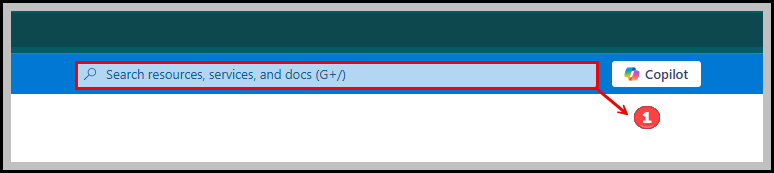  
   
- Go to [Azure Portal](https://portal.azure.com/)
- Click on "Sign in" and enter your credentials
- Once logged in, find the search bar at the top
- To the right of the search bar, you'll see the "Copilot" feature
- Take a screenshot of this area for your documentation

   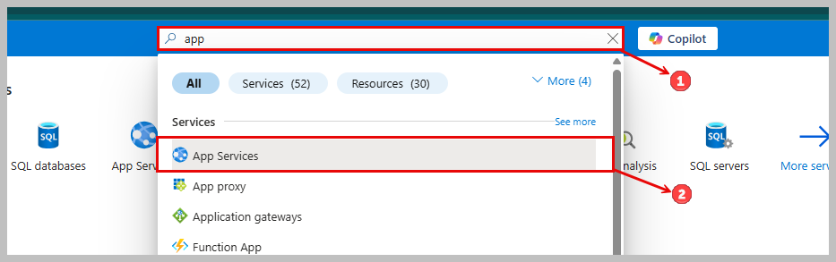
  
- **Search for "App Services"**:
  - Use the search bar at the top of the Azure portal.
  - Type "app" to filter services.
  - Select "App Services" from the list.

- **Create a Web App**:
  - Click on "App Services" to access the service page.
  - Follow the on-screen instructions to create your web app.
 
   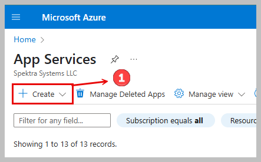
- **Navigate to App Services**: Go to the App Services section in the Azure portal.
- **Create a New App Service**: Click on the "Create" button to start the process.

 
   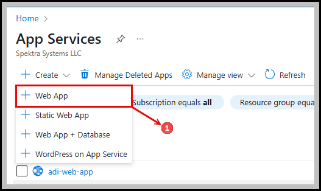
- **Create a Web App**:
  - In the Azure portal, navigate to App Services.
  - Click on "Create" and select "Web App" from the dropdown menu.

   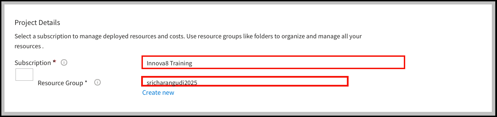
## Selecting Subscription and Resource Group

When creating a web app in Azure, you need to specify a subscription and a resource group to manage your resources effectively. Here's how you can do it:

1. **Choose a Subscription**:
   - In the "Project Details" section of the Azure portal, locate the "Subscription" dropdown menu.
   - Click on the dropdown to view a list of available subscriptions.
   - Select the subscription you want to use for deploying your web app. This is where you'll manage the resources and costs associated with your app.

2. **Select or Create a Resource Group**:
   - Below the "Subscription" dropdown, find the "Resource Group" dropdown menu.
   - Click on the dropdown to see a list of existing resource groups within your selected subscription.
   - Choose an existing resource group where you want to place your web app, or select "Create new" to create a new resource group specifically for your web app.
   - If you opt to create a new resource group, you'll need to provide a unique name for it. This acts like a folder to organize and manage all the resources related to your web app.

By following these steps, you ensure that your web app is properly organized within your Azure environment, making it easier to manage and maintain.

   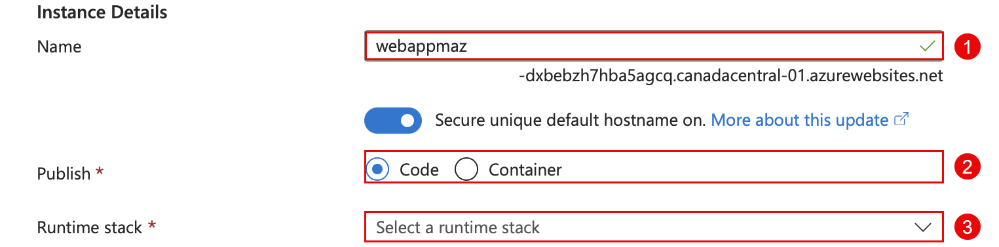
## Configuring Instance Details for a Web App

When setting up a new web app in Azure, you'll need to configure the instance details. This includes specifying the name, publish method, and runtime stack. Here's how to do it:

1. **Set the Web App Name**:
   - Enter a unique name for your web app in the "Name" field.
   - Azure will automatically generate a default hostname based on your app name.

2. **Choose the Publish Method**:
   - Select either "Code" or "Container" depending on how you plan to deploy your application.
   - "Code" is suitable for deploying applications directly from your source code.
   - "Container" is used for deploying containerized applications.

3. **Select the Runtime Stack**:
   - Choose the appropriate runtime stack from the dropdown menu.
   - This selection determines the language and framework your application will run on, such as .NET, Node.js, Python, etc.

By configuring these settings, you ensure that your web app is set up correctly to meet your development and deployment needs.

   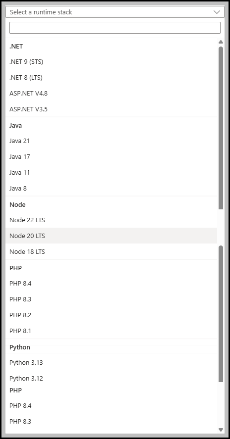
## Selecting a Runtime Stack

When configuring your web app in Azure, you'll need to choose a runtime stack that matches your application's requirements.

   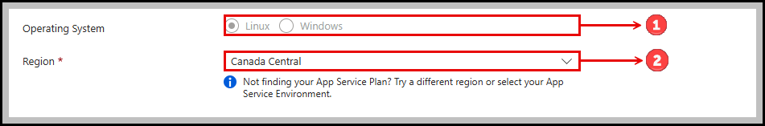
## Setting Up Web App Configuration

To properly configure your web app in Azure, you need to select an operating system and a region:

1. **Choose Operating System**:
   - Select between Linux or Windows as the operating system for your web app.
   - This choice affects the environment in which your app will run.

2. **Select Region**:
   - Choose the region closest to your target audience to minimize latency.
   - The selected region in the example is "Canada Central".

Note: If you don't see your App Service Plan, consider trying a different region or checking your App Service Environment settings.

   
## Configuring Pricing Plans for Azure Web App

To configure the pricing plan for your web app in Azure, follow these steps:

1. **Select App Service Plan**:
   - Choose an existing Linux Plan or create a new one.
   - In the example, a new plan named "charan" is selected.

2. **Choose Pricing Plan**:
   - Select the pricing plan that fits your app's requirements.
   - The example shows the selection of "Basic B1" which includes 100 total ACU, 1.75 GB memory, and 1 vCPU.

   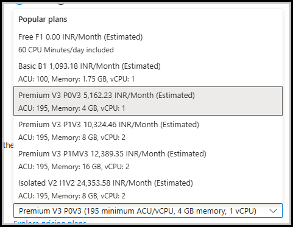
## Selecting an App Service Plan

When configuring your Azure web app, you need to choose an App Service plan that fits your needs. Here are some popular options:

- **Free F1**: 
  - Estimated cost: 0.00 INR/Month
  - Includes 60 CPU minutes/day

- **Basic B1**: 
  - Estimated cost: 1,093.18 INR/Month
  - Includes 100 ACU, 1.75 GB memory, 1 vCPU

- **Premium V3 Plans**:
  - **P0V3**: 
    - Estimated cost: 5,162.23 INR/Month
    - Includes 195 ACU, 4 GB memory, 1 vCPU
  - **P1V3**: 
    - Estimated cost: 10,324.46 INR/Month
    - Includes 195 ACU, 8 GB memory, 2 vCPUs
  - **P1MV3**: 
    - Estimated cost: 12,389.35 INR/Month
    - Includes 195 ACU, 16 GB memory, 2 vCPUs

- **Isolated V2 Plans**:
  - **I1V2**: 
    - Estimated cost: 24,353.58 INR/Month
    - Includes 195 ACU, 8 GB memory, 2 vCPUs

Choose the plan that best matches your app's performance and budget requirements.

   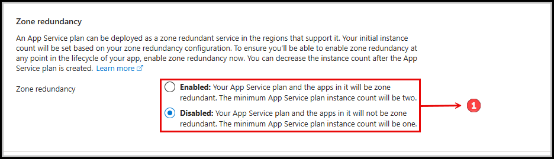
## Configuring Zone Redundancy

Zone redundancy provides high availability for your Azure App Service plan by deploying it across multiple zones within a region:

1. **Enable Zone Redundancy**:
   - When enabled, your App Service plan and the apps within it will be zone redundant.
   - The minimum App Service plan instance count will be two to ensure redundancy.

2. **Disable Zone Redundancy**:
   - When disabled, your App Service plan and the apps within it will not be zone redundant.
   - The minimum App Service plan instance count will be one.

**Note**: Enabling zone redundancy ensures high availability but may increase costs due to the minimum instance count requirement.

   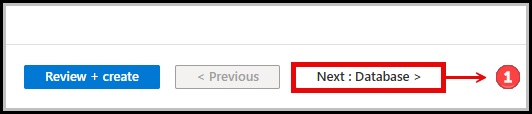
## Navigation Options in Azure Web App Creation

During the setup of an Azure web app, you will encounter several navigation options:

1. **Review + create**: 
   - This button allows you to review your current selections and create the web app if everything is correct.

2. **Previous**: 
   - Use this option to go back to the previous step in the setup process to make changes.

3. **Next: Database**: 
   - This button takes you to the next step, which involves setting up a database for your web app.

   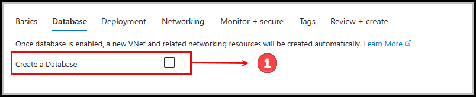
## Database Configuration in Azure Web App

When setting up a web app in Azure, you have the option to create a database:

1. **Create a Database Option**:
   - You can choose to create a new database by toggling the switch to enable it.
   - Note: Enabling this option will automatically create a new VNet and related networking resources.

This step is part of the process where you can configure additional resources for your web application in Azure.

   

## Setting Up a Database in Azure

To configure a database for your Azure web app, follow these steps:

1. **Enable Database Creation**:
   - Check the box to create a new database.

2. **Choose Database Engine**:
   - Select the database engine. In this case, `PostgreSQL - Flexible Server (recommended)` is chosen.

3. **Specify Server Name**:
   - Enter a unique name for the database server, e.g., `charan-server`.

4. **Provide Database Name**:
   - Name your database, for example, `charan-database`.

5. **Optional: Create Azure Cache for Redis**:
   - Optionally, you can check the box to create an Azure Cache for Redis to improve your app's performance.

These steps will guide you through the process of setting up a database that can be used with your Azure web app.

   

## Setting Up Azure Cache for Redis

To create an Azure Cache for Redis as part of your web app configuration, follow these steps:

1. **Enable Azure Cache for Redis**:
   - Check the box to create a new Redis cache.

2. **Name Your Cache**:
   - Enter a unique name for your Redis cache, e.g., `charan`.

3. **Choose the SKU**:
   - Select the pricing tier for your cache. In this example, the `Standard` SKU is chosen.

These settings will configure a Redis cache that can be used to enhance your web app's performance.

   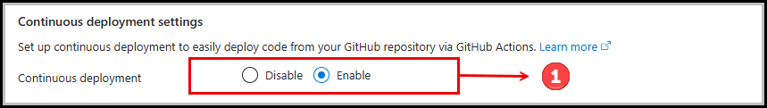

   

## Final Step: Review and Create Web App

Before creating your web app in Azure, review your configurations and then proceed with the creation:

1. **Review + create**:
   - Click the "Review + create" button to review all the settings you've chosen for your web app.
   - This includes the app name, subscription, resource group, operating system, region, and other configurations.
   - After reviewing, click this button again to create your web app.

2. **Previous**:
   - Use the "< Previous" button to go back to the previous step if you need to make changes.

3. **Next: Monitor + secure**:
   - After creating the web app, you can use the "Next: Monitor + secure" button to proceed to the monitoring and security configuration for your app.

This step finalizes the creation process and initiates the deployment of your web app in Azure.

   
   

## Review Web App Configuration

Before creating your web app, review the configuration details:

- **Web App Plan**: 
  - Chosen plan is `Basic (B1) sku`.
  - Estimated monthly cost is `1093.18 INR`.

- **Authentication**:
  - A notification indicates that basic authentication is currently disabled, which may impact deployments.

Confirm the details and proceed with the creation of your web app.

   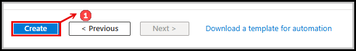
   
## Final Step: Create Web App

- **Create Button**: Click the "Create" button to initiate the deployment of your web app.
- **Previous Step**: Use the "< Previous" button to return to the previous configuration step if needed.
- **Next Step**: After creation, the "Next >" button will lead you to additional setup options.

   

## Deployment Process

- **Status**: Deployment is currently in progress.
- **Deployment Name**: Microsoft.Web-WebApp-Portal-e87126e2-8283
- **Subscription**: Innova8 Training
- **Resource Group**: charansh.charan7

The deployment details can be viewed for more information on the progress and status of the deployment.

   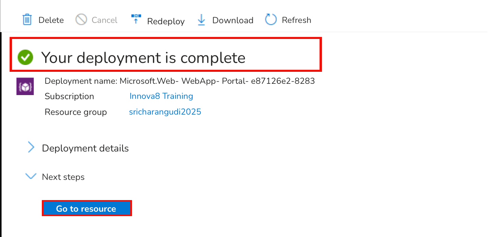
   

## Deployment Completion

- **Status**: Your deployment is complete.
- **Deployment Name**: Microsoft.Web-WebApp-Portal-e87126e2-8283
- **Subscription**: Innova8 Training
- **Resource Group**: charansh.charan17

You can now navigate to the resource to view your deployed web app.

   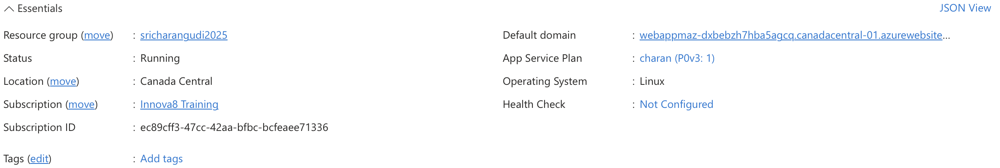

## Web App Deployment Details

- **Default Domain**: charanwebo-a9hub8gjdxdvbucx.centralus-01.azurewebsites.net
- **App Service Plan**: gg (B1: 1)
- **Operating System**: Linux
- **Health Check**: Not Configured

This information provides an overview of the web app's configuration in Azure.

   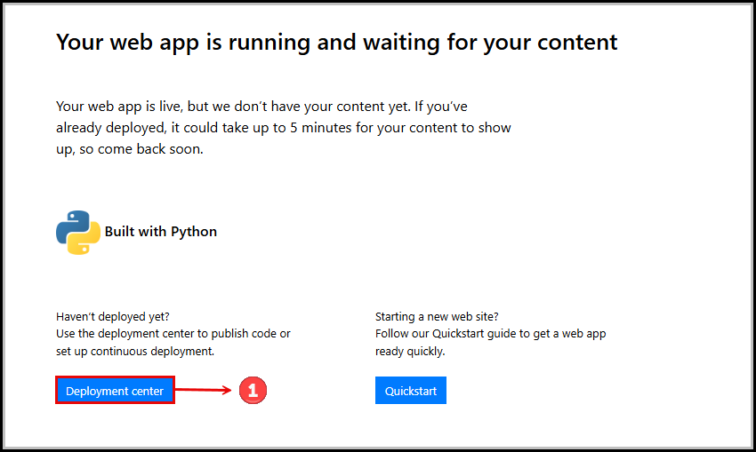

## Web App Status

- **Web App Status**: Your web app is running and waiting for your content.
- **Content Deployment**: If you've already deployed, it may take up to 5 minutes for the content to appear.
- **Built With**: The app is built with Python.
- **Next Steps**:
  - Use the [Deployment center](#) to publish code or set up continuous deployment.
  - Follow the [Quickstart](#) guide to quickly get your web app ready.
